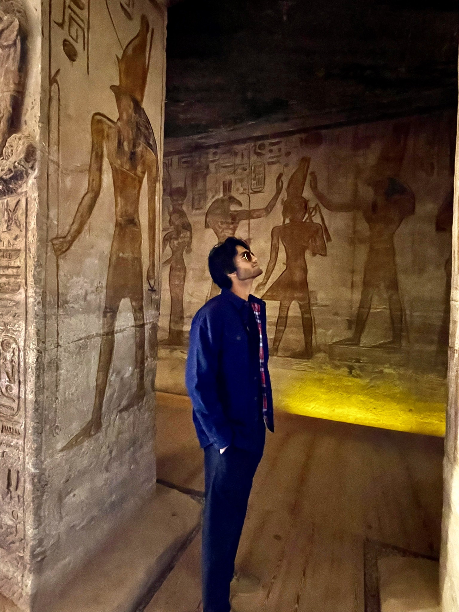

```{=html}
<style>
  body {
    display: flex;
    justify-content: center;
    align-items: center;
    height: 100vh;
    margin: 0;
  }
</style>
```
```{r, echo=F, warning=F, message=F}
if (!require("pacman")) install.packages("pacman")
pacman::p_load(knitr)
```

### 

```{r, echo=FALSE, fig.cap="Hi! I am Aman.", out.width = '30%', fig.align='center'}

```

<h6 style="text-align: center;">

</h6>

I am an undergraduate Biomedical engineering student at the Joint BME program within NC State University and UNC Chapel Hill. My research projects include a wide range of scientific areas such as Python package building, chronobiology, chromatin mining, machine learning, and stem cell biology.

------------------------------------------------------------------------

<a href="https://www.linkedin.com/in/amanprasanna/" target="_blank" rel="noopener noreferrer" class="linkedin-link">  </a>

```{=html}
<style>
.linkedin-link img {
    transition: filter 0.3s ease;
}

.linkedin-link img:hover {
    filter: brightness(150%);
}
</style>
```
<a href="mailto:amanprasanna1@gmail.com" class="email-link">  </a>

```{=html}
<style>
.email-link img {
    transition: filter 0.3s ease;
}

.email-link img:hover {
    filter: brightness(120%) hue-rotate(180deg);
    cursor: pointer;
}
</style>
```
